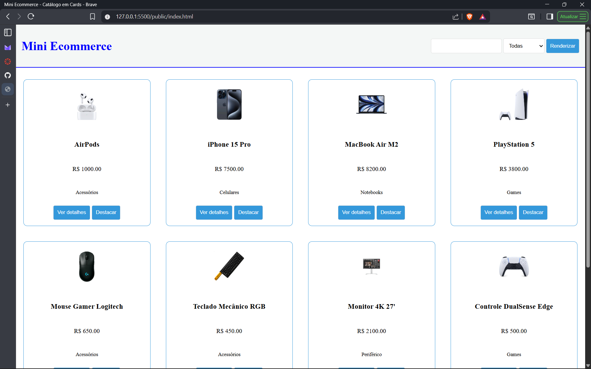
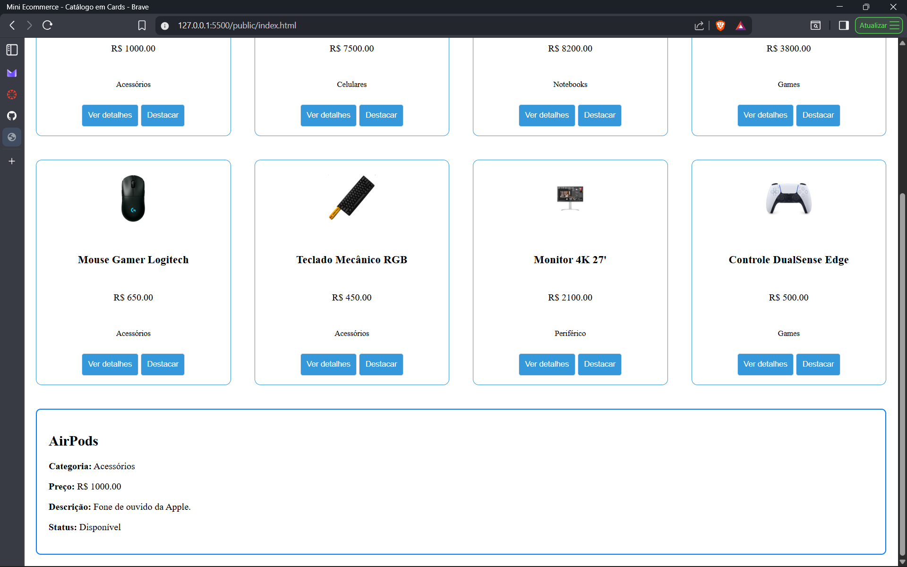
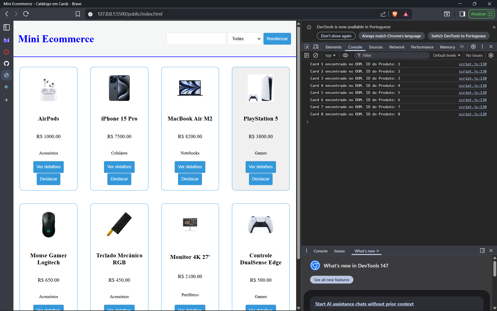

# Funções e manipulação do DOM

Nesta atividade, você vai montar um programa para praticar funções em JavaScript e a manipulação do DOM, criando uma tela simples no estilo eCommerce que lista produtos em cards a partir de um objeto JSON (array de produtos).

Você vai usar métodos e propriedades do document e seus nodos para criar elementos, definir atributos, alterar conteúdo, estilizar e registrar eventos.

A atividade foi pensada para ser concluída em até 1h no laboratório, usando Visual Studio Code e um navegador (DevTools/Console).

## Informações Gerais

- Nome: Iale Leles de Almeida
- Matricula: 927707

## Print dos cards renderizados  e da área de detalhes preenchida após clicar em “Ver detalhes”

## Print do Console do navegador mostrando alguma saída gerada por você (ex.: listagem de data-id via querySelectorAll)
